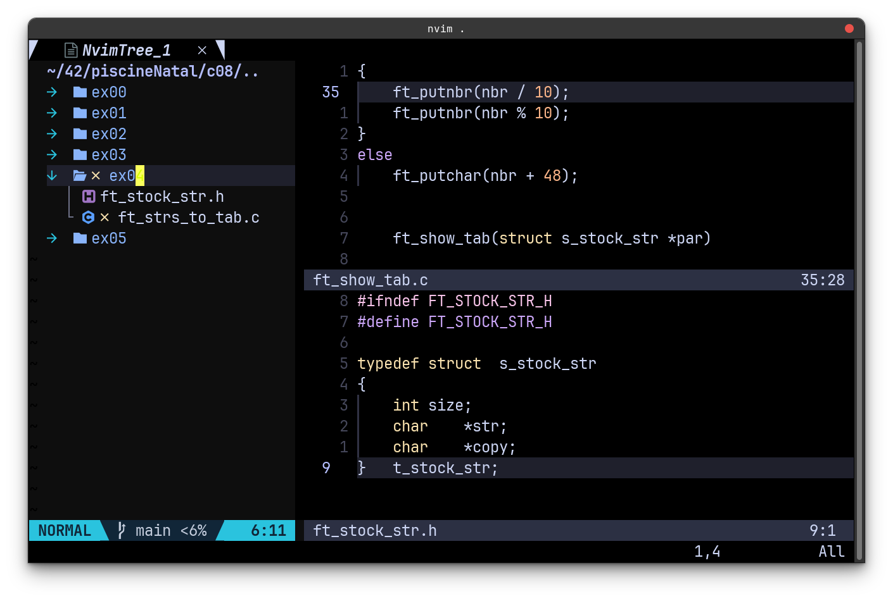

# NVIM AND TERMINAL CONFIGURATION

This is repository contains a collections of repos, which helped me to build my own configuration:

## ScreenShoots:
### Terminal Before [powerlevel10k] (https://github.com/romkatv/powerlevel10k)

### Terminal with [powerlevel10k](https://github.com/romkatv/powerlevel10k)

### Nvim before Plugins

### After Plugins

## 🔗 Nvim:

| Plugin             | Description                                                      |
| -----------------  | ------------------------------------------------------------------ |
| [nvim-lsp](https://github.com/neovim/nvim-lspconfig)|Language configurations, to Use C, python, Java, etc. language completion|
| [nvim-autopairs](https://github.com/windwp/nvim-autopairs) |Special keys completion: Example '{'= '{}'|
| [nvim-bufferline](https://github.com/akinsho/bufferline.nvim): |Tab pages for nvim|
| [nvim-coloscheme](https://github.com/catppuccin/nvim)|A beautiful theme for nvim|
| [nvim-indentline](https://github.com/lukas-reineke/indent-blankline.nvim?tab=readme-ov-file) |Visual line indentation|
| [nvim-lualine](https://github.com/nvim-lualine/lualine.nvim) | Status line for nvim    
| [nvim-treesitter](https://github.com/nvim-treesitter/nvim-treesitter) | nvim text highlighting
| [nvim-telescope](https://github.com/nvim-telescope/telescope.nvim) | Files navigator and finder
| [nvim-tree](https://github.com/nvim-tree/nvim-tree.lua) | FileExplorer, works perfectly with telescope

## 🔗 Terminal:

[Power10k](https://github.com/romkatv/powerlevel10k): The most efficient terminal theme out there: 
