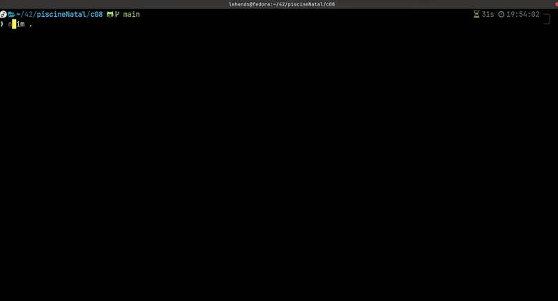

    

# NVIM AND TERMINAL CONFIGURATION
This is repository contains a collection of repos, which helped me to built a personal configuration to change from a boring and depressing terminal/nvim 💤 to a lovely one ❤️ .

## Demostration:

### 😼 After Plugins

## Or

###  Terminal with [powerlevel10k](https://github.com/romkatv/powerlevel10k)

## ⚙️  Requirements 

- [nvim](https://neovim.io/) Installed
- A plugin Manager: I use [Lazy](https://github.com/folke/lazy.nvim)
- [zsh](https://www.zsh.org/) if its not installed

## Optional:

- A linux theme: I use [WhiteSur](https://github.com/vinceliuice/WhiteSur-gtk-theme)
- A [NerdFont](https://www.nerdfonts.com/) Installed

## 🔗 Useful Links:

Configs inspired from this [video](https://www.youtube.com/watch?v=6mxWayq-s9I) 

## 🔗 Nvim:

| Plugin             | Description                                                      |
| -----------------  | ------------------------------------------------------------------ |
| [nvim-lsp](https://github.com/neovim/nvim-lspconfig)|Language configurations, to Use C, python, Java, etc. language completion|
| [nvim-autopairs](https://github.com/windwp/nvim-autopairs) |Special keys completion: Example '{'= '{}'|
| [nvim-bufferline](https://github.com/akinsho/bufferline.nvim): |Tab pages for nvim|
| [nvim-coloscheme](https://github.com/catppuccin/nvim)|A beautiful theme for nvim|
| [nvim-indentline](https://github.com/lukas-reineke/indent-blankline.nvim?tab=readme-ov-file) |Visual line indentation|
| [nvim-lualine](https://github.com/nvim-lualine/lualine.nvim) | Status line for nvim    
| [nvim-treesitter](https://github.com/nvim-treesitter/nvim-treesitter) | nvim text highlighting
| [nvim-telescope](https://github.com/nvim-telescope/telescope.nvim) | Files navigator and finder
| [nvim-tree](https://github.com/nvim-tree/nvim-tree.lua) | FileExplorer, works perfectly with telescope

## 🔗 Terminal:

- [Power10k](https://github.com/romkatv/powerlevel10k): The most efficient terminal theme out there

- [zsh-autosuggestions](https://github.com/zsh-users/zsh-autosuggestions?tab=readme-ov-file) Terminal commands suggestions 
